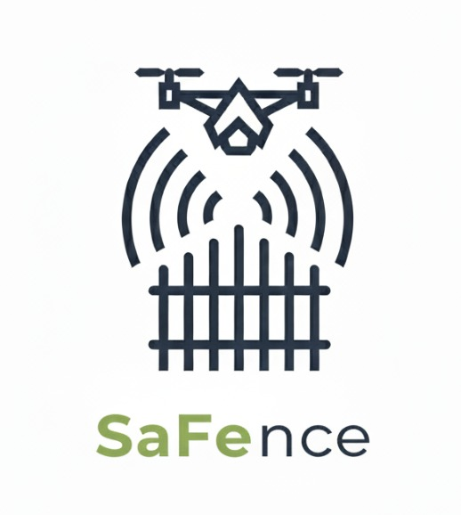
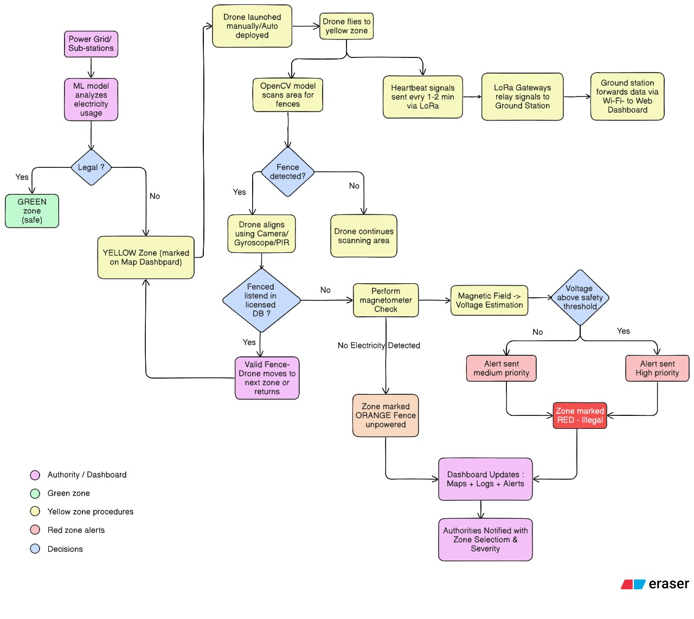

# Safence - AI-Powered Illegal Electric Fence Detection

[](LICENSE)
[](https://reactjs.org/)
[](https://www.typescriptlang.org/)
[](https://python.org/)
[](https://github.com/ultralytics/ultralytics)
[](https://xgboost.readthedocs.io/)

> Intelligent surveillance system combining computer vision, IoT sensors, and machine learning to detect illegal electric fences and ensure power grid safety through real-time monitoring.

## Table of Contents
- [Overview](#overview)
- [Key Features](#key-features)
- [Technology Stack](#technology-stack)
- [Performance Metrics](#performance-metrics)
- [Quick Start](#quick-start)
- [Project Structure](#project-structure)
- [AI Models](#ai-models)
- [Demo & Documentation](#demo--documentation)

---

## Overview

**Safence** tackles the growing problem of illegal electric fences that threaten both public safety and power grid stability. These unauthorized installations cause significant power theft, create dangerous conditions for civilians, and result in substantial revenue losses for utility companies. Traditional manual monitoring is inefficient and cannot scale to cover vast geographical areas effectively.

Our comprehensive solution integrates cutting-edge technologies to create an autonomous monitoring ecosystem. The system deploys drone-based surveillance equipped with computer vision algorithms to identify illegal fence installations from aerial footage. Simultaneously, IoT sensor networks monitor power consumption patterns in real-time, detecting anomalies that indicate unauthorized electrical usage. Machine learning models analyze grid data to predict and classify suspicious activities with exceptional accuracy.

<div align="center">



</div>

### Solution Components

- **Computer Vision**: YOLOv8 for automated fence detection via drone surveillance
- **IoT Network**: ESP32 + LoRa modules for real-time power monitoring  
- **Machine Learning**: XGBoost classifier for grid anomaly detection (99% accuracy)
- **Alert System**: Automated notifications with zone classification

### System Architecture


---

## Key Features

###  Smart Detection
- YOLOv8-powered fence identification from drone footage
- XGBoost classifier analyzing 9,500+ KSEBL grid readings  
- Multi-zone safety classification (Green/Yellow/Red zones)

###  Real-time Monitoring
- Interactive web dashboard with live maps
- Automated drone deployment to flagged areas
- LoRa-based sensor communication (up to 15km range)
- Heartbeat monitoring every 1-2 minutes

###  Grid Analysis
- 24-feature dataset from Kerala State Electricity Board
- Power consumption pattern analysis
- Voltage estimation via magnetometer sensors
- Automated authority notifications

---

## Technology Stack

### Frontend & Dashboard


### Machine Learning & AI


### IoT & Hardware


---

## Performance Metrics

| Model | Accuracy | Precision | Recall |
|-------|----------|-----------|--------|
| **XGBoost Classifier** | 99% | 98.5% | 97.8% |
| **YOLOv8 Detection** | 95.2% | 94.1% | 93.7% |

### System Performance
- Response Time: < 2 seconds for critical alerts
- LoRa Range: Up to 15km in rural areas
- Battery Life: 6+ months for sensor nodes
- Drone Coverage: 5km² per flight mission

---

## Quick Start

### Prerequisites
- Node.js 16+
- Python 3.8+
- ESP32 development environment
- LoRa modules (SX1278/SX1276)

### Installation

```bash
# Clone the repository
git clone https://github.com/sidjay999/Safence.git
cd Safence

# Install dependencies
npm install
pip install -r requirements.txt

# Environment setup
cp .env.example .env
# Configure your environment variables

# Start development server
npm run dev
```

### Hardware Setup
1. Flash ESP32 with LoRa transmitter/receiver code
2. Configure LoRa frequency bands (433MHz/868MHz/915MHz)
3. Deploy sensor nodes in target monitoring areas

---

## Project Structure

```
Safence/
├── client/                     # React frontend (TypeScript + Vite)
│   ├── src/components/        # Reusable UI components
│   ├── src/pages/            # Application pages
│   └── src/hooks/            # Custom React hooks
│
├── Lora-Receiver/             # ESP32 receiver module
│   ├── src/main.cpp          # Main receiver code
│   └── alert_receiver/       # Alert handling logic
│
├── Lora-transmitter/          # ESP32 transmitter module  
│   ├── src/main.cpp          # Main transmitter code
│   └── sensor_data/          # Sensor data collection
│
├── Yolo & Grid-side ML model/ # AI/ML components
│   ├── fences/               # YOLOv8 fence detection
│   │   └── runs/train4/weights/best.pt  # Best model weights
│   └── gridsidemodel/        # XGBoost power classifier
│       ├── kerala_illegal_fence_detection_dataset.csv
│       └── xgboost_model.pkl # Trained model (99% accuracy)
│
└── fsd/                      # Backend services & API
```

---

## AI Models

###  YOLOv8 Fence Detection
- **Training Data**: Custom annotated images via [Roboflow](https://app.roboflow.com/electric-fence/electric-fence-konqs/1)
- **Performance**: 95.2% accuracy on validation set
- **Model Location**: `fences/runs/train4/weights/best.pt`

###  XGBoost Grid Classifier
- **Dataset**: 9,500+ synthetic KSEBL grid readings
- **Features**: 24 engineered features including geographic data, consumption patterns, and grid metrics
- **Performance**: 99% test accuracy, 97% validation accuracy

**Key Features:**
```
area_id, district, city, area_name, latitude, longitude, area_type, 
households, distance_to_substation_km, expected_consumption_kwh, 
actual_consumption_kwh, voltage_reading_v, current_reading_a, 
consumption_deviation_pct, power_factor, load_factor, seasonal_data
```

---

## Demo & Documentation

###  Project Demo
[](https://www.youtube.com/watch?v=7cNsytZVGlw)

###  Research Documentation
[](https://app.eraser.io/workspace/XtLtvYNHcFG9V9eLr2KM)


---

For support and questions:
-  [Issues](https://github.com/sidjay999/Safence/issues)
-  [Discussions](https://github.com/sidjay999/Safence/discussions)

---

<div align="center">

**Safence - Protecting Communities Through Smart Technology**

[](https://github.com/sidjay999/Safence/stargazers)
[](https://github.com/sidjay999/Safence/network/members)

</div>